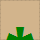
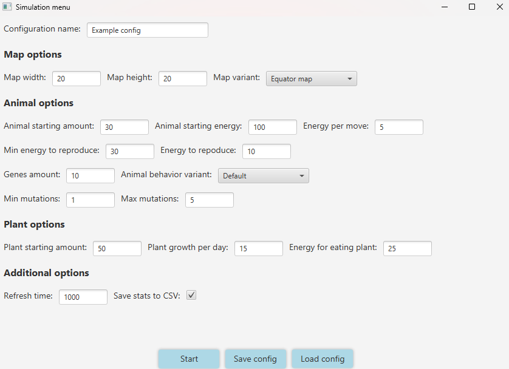
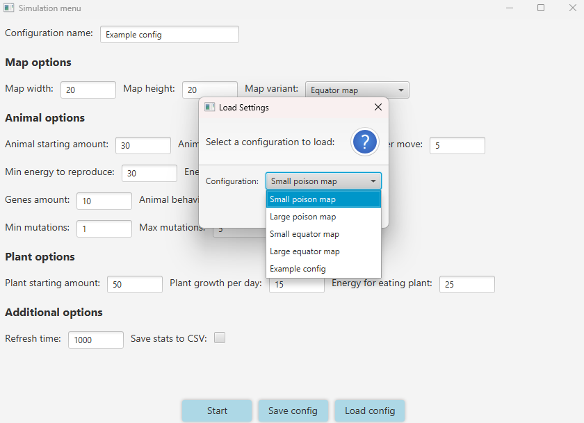
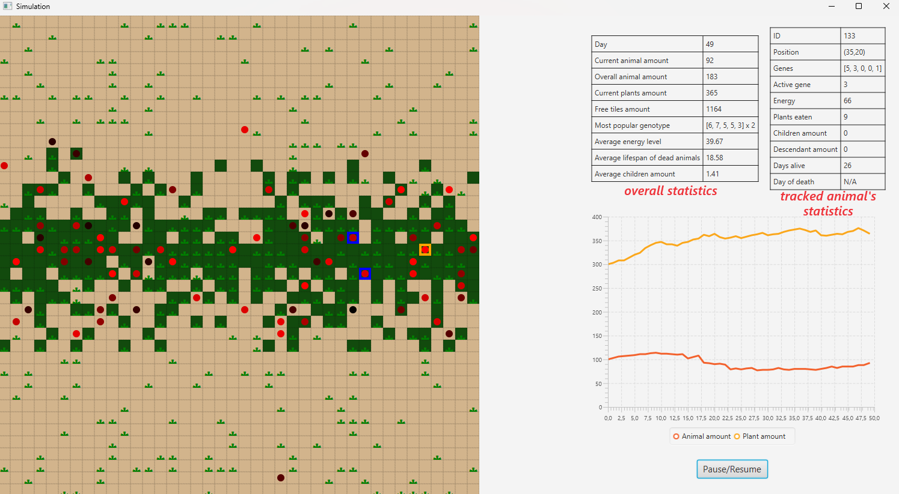
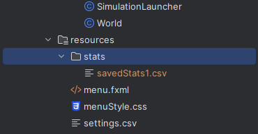

# Evolution Simulator

### Simple simulator made for Object Oriented Programming course (PO) at AGH 2023/24.


### Concept
You can find detailed description for this project on [GitHub](https://github.com/Soamid/obiektowe-lab/tree/master/proj)

### Technologies used:

- Java
- JavaFX

## Building and running the Project

The project uses Gradle for building and managing dependencies. To build the project, navigate to the project root directory and run the following command in your terminal:

```sh
./gradlew build
```

To run the simulation, use the following command:

```sh
./gradlew run
```

### Introduction

This simulator is based on simple Darwin's Theory - only strongest organisms can survive. Every day animals move, eat and reproduce. When they run out of energy they die. Every animal has genetype and his own energy level.<br>

### Legend
| Image                                       | Meaning        |
|---------------------------------------------|----------------|
| <p align="center"></p>  | Step tile |
| <p align="center"></p>  | Jungle tile |
| <p align="center"></p>  | Grass |
| <p align="center"></p>  | Healthy animal |
| <p align="center"></p>  | Dying animal |
| <p align="center"></p>  | Dominant genotype |
| <p align="center"></p>  | Tracked animal |

### Before simulation
Simulation takes place on the step-map with either small square jungle somewhere on the map or with jungle all across the equator, depending on the starting config. 
Before simulation user can choose his own options: size of the map, starting number of animals and plants, the amount of energy the animals get at the beginning, the amount of energy the animals lose each move and the amount of energy the animals get after eating a plant, etc.



You can also save your config or load a previously saved one.



### Statistics
Statistics are updated every day of simulation. <br>
You can track for example:
* number of plants and animals
* dominant (the most common) genotype
* average lifespan, child number and current energy<br>

Additionally, a chart is drawn monitoring the number of animals and plants.



### Animals with dominant genotype
After pausing the simulation, all alive animals with dominant genotype will be highlighted.

### Save to CSV file
After clicking on "Save to CSV" all statistics will be saved to CSV file.



### Authors
Jakub Konopka<br/>
Mateusz Bobula
